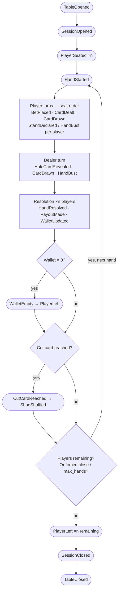

# Technical Product Specification — python-blackjack

## 1. System Overview

python-blackjack is a blackjack simulator written in Python. It models the card game Blackjack, allowing developers to simulate games, test strategies, and observe outcomes. The simulator is headless — no UI, no user input — driven entirely by code and testable end-to-end with pytest.

---

## 2. Architecture

### Modules

| Module | Responsibility |
|---|---|
| `src/cards.py` | Card and Deck — the building blocks of the game |
| `src/hand.py` | Hand — a collection of cards with a calculated value |
| `src/deal.py` | Deal logic — shuffling and dealing the opening hand |

### Data Flow

Deck (52 cards) → shuffle → deal_initial() → Player Hand (2 cards, both visible) + Dealer Hand (2 cards, 1 visible, 1 hidden)

---

## 3. Component Specifications

### Card

Represents a single playing card.

- Has a rank: 2–10, Jack, Queen, King, Ace
- Has a suit: Hearts, Diamonds, Clubs, Spades
- Has a numeric value: 2–10 = face value; Jack/Queen/King = 10; Ace = 11 or 1 (whichever keeps the hand from busting)
- Is immutable — a card does not change once created

### Deck

Represents a standard 52-card deck.

- Contains exactly one of each card (13 ranks × 4 suits)
- Can be shuffled (random order, seeded for testing)
- Cards are dealt one at a time from the top
- Raises an error if asked to deal from an empty deck

### Hand

Represents a collection of cards held by a player or dealer.

- Holds one or more cards
- Calculates its total value, handling Ace as 11 or 1 to avoid bust where possible
- Knows whether it is a blackjack (exactly 21 with 2 cards)
- Knows whether it is bust (value exceeds 21)

### deal_initial()

Deals the opening hand of a round.

- Takes a shuffled deck as input
- Returns a player hand (2 visible cards) and a dealer hand (1 visible card, 1 hidden card)
- Does not modify game state beyond removing 4 cards from the deck

---

## 4. Error Handling

- Dealing from an empty deck raises a descriptive exception
- All errors are raised explicitly — no silent failures

---

## 5. Known Unknowns

- Shuffling algorithm: standard random.shuffle for now; may need seeding strategy for reproducible simulations
- Multiple decks (shoe): not in scope yet
- Splitting, doubling down, insurance: not in scope yet

---

## 6. PBI-1.2 — Single Hand Engine

### Game Flow

1. Player wallet initialised at 100 UoM
2. Bet of 1 UoM placed and deducted from wallet
3. Deck created (52 cards), shuffled, logged with deck size
4. Opening hand dealt — player 2 visible cards, dealer 1 visible + 1 hidden — each card logged with resulting hand value
5. Player turn — hit on 16 or under, stand on 17+ — each event logged with card and hand value
6. Dealer reveals hole card — logged with resulting hand value
7. Dealer turn — hit on 16 or under, stand on 17+ — each event logged with card and hand value
8. Outcome determined and logged with reason
9. Wallet updated and logged
10. If wallet reaches 0, player leaves the table — logged
11. Exit

### Payout Rules

| Outcome | Payout |
|---|---|
| Player blackjack | 3:2 (1.5 UoM profit on 1 UoM bet) |
| Player wins (non-blackjack) | 1:1 (1 UoM profit) |
| Push | Bet returned (no change) |
| Dealer wins | Bet lost (−1 UoM) |

### New Modules

| Module | Responsibility |
|---|---|
| `src/player.py` | Player — wallet, bet, strategy (pluggable behaviour) |
| `src/dealer.py` | Dealer — strategy (deterministic: hit ≤16, stand ≥17), hole card reveal |
| `src/game.py` | Game engine — orchestrates a single hand end-to-end |
| `src/logger.py` | Structured event logger — all card, bet, wallet, and outcome events |

### Logged Events

| Event | Example message |
|---|---|
| Deck shuffled | `[DECK] Shuffled 52-card deck` |
| Bet placed | `[BET] Player bets 1 UoM — wallet: 99 UoM` |
| Card dealt | `[DEAL] Player dealt 7 of Hearts — hand value: 7` |
| Card dealt | `[DEAL] Player dealt King of Spades — hand value: 17` |
| Dealer visible | `[DEAL] Dealer shows Ace of Diamonds — hand value: 11` |
| Dealer hidden | `[DEAL] Dealer has 1 hidden card` |
| Player hits | `[HIT] Player hits: 5 of Clubs — hand value: 15` |
| Player stands | `[STAND] Player stands on 19` |
| Player busts | `[BUST] Player busts with 23` |
| Hole card revealed | `[REVEAL] Dealer reveals: King of Hearts — hand value: 17` |
| Dealer hits | `[HIT] Dealer hits: 3 of Diamonds — hand value: 14` |
| Dealer stands | `[STAND] Dealer stands on 18` |
| Dealer busts | `[BUST] Dealer busts with 24` |
| Outcome | `[OUTCOME] Player wins — player 20 beats dealer 17` |
| Outcome | `[OUTCOME] Dealer wins — dealer 19 beats player 16` |
| Outcome | `[OUTCOME] Push — both have 18` |
| Outcome | `[OUTCOME] Player blackjack — pays 3:2` |
| Wallet updated | `[WALLET] Player wallet: 101 UoM` |
| Player leaves | `[TABLE] Player leaves — wallet reached 0 UoM` |

### Strategy Interface

Player strategy is pluggable — a callable that takes a hand and returns `"hit"` or `"stand"`. For PBI-1.2, player strategy mirrors dealer strategy: hit on 16 or under, stand on 17+.

### Error Handling

- Deck must have at least 4 cards before dealing — already enforced by `deal_initial()`
- Wallet cannot go below 0 — raise `ValueError` if bet exceeds wallet balance

---

## 7. PBI-1.3 — Structured Logger

### Overview

Note: The "Logged Events" table above reflects the legacy (pre-PBI-1.3) flat logger; from PBI-1.3 onward, the structured JSONL/HRF events supersede DECK/TABLE with session-level SHUFFLE/LEAVE/CLOSE.

Introduces a `GameEvent` dataclass and `emit_event()` function that replace the flat `log_event()` helper. Every game event carries a structured payload — emitted as a JSONL record to a per-session file and as a human-readable one-liner (HRF) to stdout via the `blackjack` logger.

### `GameEvent` Dataclass

```python
@dataclass
class GameEvent:
    eventType: str       # e.g. "BET", "DEAL", "OUTCOME"
    sessionId: str       # UUID of the current session
    data: dict           # free-form payload; "message" used for HRF when present (else falls back)
    handId: str | None   # UUID of the current hand (omitted for session-level events)
    actor: str | None    # player or dealer name (may be set; omitted from HRF when handId is None)
    eventId: str         # UUID auto-generated per event
    timestamp: str       # ISO-8601 UTC, seconds precision, auto-generated
```

### `emit_event()` Behaviour

- Appends a JSON object to the `session_file` path (creates parent dirs as needed).
- JSON object includes all non-None fields: `eventId`, `eventType`, `timestamp`, `sessionId`, `data`, and optionally `handId`, `actor`.
- `handId` and `actor` are **omitted** from JSON when `None`.
- On JSONL write failure, emits a `warnings.warn` and continues — never crashes the game.
- Emits HRF to stdout via `logging.getLogger("blackjack").info(...)`.

### HRF Format

```
[EVENTTYPE] | sess:XXXXXXXX | hand:YYYYYYYY | evt:ZZZZZZZZ | actor:NAME — message
```

- `sess:`, `hand:`, `evt:` use the **last 8 characters** of the respective UUIDs.
- `hand:` and `actor:` segments are **omitted** for session-level events.
- `message` is taken from `event.data["message"]`; if absent, falls back to `json.dumps(event.data)`.

### `play_hand()` Signature Change

```python
def play_hand(player: Player, session_id: str, session_file: Path, deck: Deck) -> None:
```

- `session_id` and `session_file` passed in by the caller.
- `deck` passed in pre-shuffled.
- `seed` parameter removed.
- A `handId` UUID is generated at the top of `play_hand()` and attached to all hand-level events.
- All `log_event()` calls replaced by `emit_event(GameEvent(...), session_file)`.

### `play_hand_standalone()` Wrapper

Temporary wrapper for running a single hand; kept for backward compatibility and tests:

```python
def play_hand_standalone(player: Player, seed: int | None = None) -> None:
```

Generates its own `session_id` and `session_file`, creates and shuffles the deck, then delegates to `play_hand()`.

### Module Location

`src/logger.py`

---

## 8. PBI-1.4 — Game Session Loop

### Overview

A session loops over multiple hands using a single shared deck, applying a cut-card policy to trigger reshuffles, and terminates either when the player runs out of funds or when the maximum number of hands is reached.

### Session Flow

1. Log `[OPEN]` with player name, max hands, starting wallet
2. Create and shuffle deck (seeded for reproducibility), log `[SHUFFLE]`
3. For each hand 1..max_hands:
   a. Log `[HAND]` with hand number and current wallet
   b. Call `play_hand(player, session_id, session_file, deck)` — deck is passed in (not created internally)
   c. If wallet == 0: log `[LEAVE]` (no funds) + `[CLOSE]` and return
   d. If `len(deck) <= max(cut_card, 4)`: log `[CUT]`, reshuffle, log `[SHUFFLE]`
4. After max_hands: log `[LEAVE]` (max hands reached) + `[CLOSE]`

### Refactors to `play_hand()`

- Signature: `play_hand(player: Player, session_id: str, session_file: Path, deck: Deck) -> None` — session context and deck are passed in by the caller
- `seed` parameter removed; shuffling is the caller's responsibility
- `DECK` event removed from `play_hand()` — replaced by `SHUFFLE` in `play_session()`
- `TABLE` event removed; `play_hand()` emits `WalletEmpty` on zero wallet; `play_session()` emits `LEAVE`
- New `PAYOUT` event logged at every payout point

### New Events

| Event | Example message |
|---|---|
| Session opened | `[OPEN] Session started — player: Alice, max hands: 10, starting wallet: 100 UoM` |
| Deck shuffled | `[SHUFFLE] Shuffled 52-card deck` |
| Hand started | `[HAND] Hand 1 of 10 — wallet: 100 UoM` |
| Cut card reached | `[CUT] Cut card reached — reshuffling after this hand` |
| Payout | `[PAYOUT] Player receives 2.5 UoM — blackjack 3:2` |
| Payout | `[PAYOUT] Player receives 2 UoM — win` |
| Payout | `[PAYOUT] Player receives 1 UoM — push` |
| Player leaves | `[LEAVE] Player leaves — no funds` (actor: player name) |
| Player leaves | `[LEAVE] Player leaves — max hands reached` (actor: player name) |
| Session closed | `[CLOSE] Session closed — hands played: 10, final wallet: 95 UoM, reason: max hands reached` |

### `play_session()` Signature

```python
def play_session(
    player: Player,
    max_hands: int = 10,
    cut_card: int = 39,
    seed: int | None = None,
) -> None:
```

### Validation

- `max_hands < 1` → `ValueError`
- `cut_card < 1 or cut_card >= 52` → `ValueError`

### Updated `main.py`

`main()` calls `play_session(player)` instead of `play_hand(player)`.

---

## 9. PBI-1.5 — Event Model Refactor

### Overview

Refactors the event model to apply finalised design decisions deferred from PBI-1.3/1.4:

1. All `eventType` values migrate to PascalCase
2. JSONL files become session-bound with a timestamp+sessionId filename
3. HRF tag automatically reflects PascalCase eventType

This is a pure refactor — no new behaviour, no new events, no signature changes.

### EventType Migration

| Current | PBI-1.5 |
|---|---|
| `OPEN` | `SessionOpened` |
| `CLOSE` | `SessionClosed` |
| `HAND` | `HandStarted` |
| `SHUFFLE` | `ShoeShuffled` |
| `CUT` | `CutCardReached` |
| `BET` | `BetPlaced` |
| `DEAL` | `CardDealt` |
| `HIT` | `CardDrawn` |
| `STAND` | `StandDeclared` |
| `BUST` | `HandBust` |
| `REVEAL` | `HoleCardRevealed` |
| `OUTCOME` | `HandResolved` |
| `PAYOUT` | `PayoutMade` |
| `WALLET` | `WalletUpdated` |
| `LEAVE` | `PlayerLeft` |
| `WalletEmpty` | `WalletEmpty` (no change) |

### JSONL File Naming

Current: `logs/session-{sessionId[-8:]}.jsonl`

PBI-1.5: `logs/blackjack-{YYYYmmddTHHMMSS}-{sessionId[-8:]}.jsonl`

Example: `logs/blackjack-20260618T211752-b7c19a2d.jsonl`

- Timestamp is UTC, compact ISO 8601 format, seconds precision
- Session file path determined once when `SessionOpened` fires
- Path held for entire session lifetime — all events for a session write to the same file
- Guarantees a complete session is always contained in one file — no cross-hour boundary problem
- `play_session()` and `play_hand_standalone()` both updated to use new naming

### HRF Format

No change required — HRF renders `event.eventType` directly, so PascalCase migration falls out automatically.

Before: `[BET] | sess:b7c19a2d | ...`
After:  `[BetPlaced] | sess:b7c19a2d | ...`

### Event Envelope

No changes to `GameEvent` dataclass fields or `emit_event()` signature.

| Field | Type | Notes |
|---|---|---|
| `eventId` | UUID4 | Auto-generated |
| `eventType` | str (PascalCase) | |
| `timestamp` | ISO-8601 UTC | Auto-generated, seconds precision |
| `sessionId` | UUID4 | |
| `handId` | UUID4 | Optional — omitted for session-level events |
| `actor` | str | Optional — omitted from HRF when `handId` is None |
| `data` | `dict[str, Any]` | `message` key used for HRF when present, else falls back to `json.dumps` |

### Session-Level vs Hand-Level Events

| eventType | Level | actor | handId |
|---|---|---|---|
| `SessionOpened` | session | — | — |
| `SessionClosed` | session | — | — |
| `HandStarted` | session | — | — |
| `ShoeShuffled` | session | — | — |
| `CutCardReached` | session | — | — |
| `BetPlaced` | hand | player name | ✓ |
| `CardDealt` | hand | player or dealer | ✓ |
| `CardDrawn` | hand | player or dealer | ✓ |
| `StandDeclared` | hand | player or dealer | ✓ |
| `HandBust` | hand | player or dealer | ✓ |
| `HoleCardRevealed` | hand | dealer | ✓ |
| `HandResolved` | hand | — | ✓ |
| `PayoutMade` | hand | player name | ✓ |
| `WalletUpdated` | hand | player name | ✓ |
| `WalletEmpty` | hand | player name | ✓ |
| `PlayerLeft` | session | player name | — |

Note: `PlayerLeft` carries `actor` but is session-level — `actor:` is omitted from HRF since `handId` is None.

### Breaking Changes

- All `eventType` string literals in `game.py` renamed to PascalCase
- All `eventType` assertions in test files updated to PascalCase
- JSONL filename format changes in `play_session()` and `play_hand_standalone()`
- TPS Section 8 event table updated to PascalCase

### Future EventTypes (Icebox)

The following eventTypes are reserved for future PBIs and must not be used before they are formally specced:

| eventType | Planned for |
|---|---|
| `SplitTaken` | Future split PBI |
| `DoubleDown` | Future double-down PBI |
| `PlayerSeated` | Future multiplayer PBI |
| `PlayerJoined` | Future multiplayer PBI |
| `TableOpened` | ICE-3 multiplayer PBI |
| `TableClosed` | ICE-3 multiplayer PBI |
| `PlayerSeated` | ICE-3 multiplayer PBI |

### JSONL Viewer (Icebox)

A viewer module that reads session JSONL files and replays the event stream is planned after PBI-1.5. The viewer can assume a complete session is always contained in one file — guaranteed by the session-bound file design above.

### Test Strategy

- All existing tests pass after rename — only `eventType` string assertions change
- No new tests required — behaviour is unchanged
- Crog must search for every occurrence of old eventType strings in test files and update them all
- Coverage threshold (80%) must still pass after refactor

---

## 10. ICE-3 — Multiplayer / Table Entity

### Overview

Introduces a `Table` entity that hosts multiple players sharing a single shoe. Players take turns in seat order before the dealer plays. A session is scoped to the table's lifetime — one JSONL file per table session.

This spec does not include the floor manager or hall layers — those are ICE-8 and ICE-9.

---

### `Table` Entity

```python
@dataclass
class Table:
    tableId: str              # UUID4
    maxSeats: int             # capacity, e.g. 7
    minBet: float             # minimum bet (UoM)
    maxBet: float             # maximum bet (UoM)
    numDecks: int             # shoe size — 1, 2, 4, 6, or 8
    players: list[Player]     # seated players, len ≤ maxSeats
    dealer: Dealer
    houseRules: HouseRules
```

### `HouseRules` Entity

```python
@dataclass
class HouseRules:
    blackjackPayout: float    # e.g. 1.5 for 3:2, 1.2 for 6:5
    dealerHitsOnSoft17: bool  # True = dealer hits soft 17
```

`HouseRules` is defined here and will be extended by ICE-7 (double down, split, insurance, surrender).

---

### Player Entity Extension

`Player` gains a `vip: bool` attribute (default `False`). Used by the floor manager (ICE-8) for queue priority — not used by table logic.

---

### Session Scope

One session per table lifetime. `sessionId` is generated when the table opens. All events for the table's lifetime write to one JSONL file.

JSONL filename: `logs/blackjack-{YYYYmmddTHHMMSS}-{sessionId[-8:]}.jsonl` — unchanged from PBI-1.5.

---

### Event Sequence

**Setup:**
1. `TableOpened` — table created, session starts, JSONL file created
2. `SessionOpened` — game ready to accept players
3. `PlayerSeated` (×n) — each player takes a seat (setup phase only)

**Per hand:**
4. `HandStarted` — hand number, current wallets
5. Each player takes their turn in seat order, then dealer plays
6. `PayoutMade`, `WalletUpdated`, `WalletEmpty` as applicable per player
7. `PlayerLeft` — fires for any player whose wallet hits zero after hand resolution
8. If `len(deck) <= max(cut_card, 4)`: `CutCardReached` → `ShoeShuffled`

**Termination — natural:**
9. When last player leaves: `SessionClosed` → `TableClosed`

**Termination — forced (hall closing):**
9. Close signal received → finish current hand → `PlayerLeft` (×n, all remaining players) → `SessionClosed` → `TableClosed`



---

### Turn Order

Within each hand, players act in seat order (seat 1 → seat 2 → ... → seat N), then the dealer acts once. Each player's turn runs the full hit/stand loop as in the single-player engine.

---

### Shared Shoe

All players and the dealer draw from a single shoe. Shoe size is `numDecks × 52` cards, shuffled together. Cut card policy unchanged — reshuffle when `len(deck) <= max(cut_card, 4)`.

---

### Session Termination

| Trigger | Behaviour |
|---|---|
| Player wallet = 0 | `PlayerLeft` fires after hand resolution; player removed from table |
| All players gone | `SessionClosed` → `TableClosed` |
| Forced close signal | Finish current hand → `PlayerLeft` (×n) → `SessionClosed` → `TableClosed` |
| `max_hands` reached | `PlayerLeft` (×n) → `SessionClosed` → `TableClosed` |

`max_hands` is an optional session limit (default `None` = unlimited). In standard casino play it is not set. It is legitimate in specific contexts (tournaments, promotional tables, reserved sessions) and is also useful for test/dev scenarios where a deterministic termination condition is needed.

---

### New Events

| eventType | Level | actor | handId | Notes |
|---|---|---|---|---|
| `TableOpened` | session | — | — | Table created |
| `TableClosed` | session | — | — | Table shut down |
| `PlayerSeated` | session | player name | — | Setup-phase seating only |

`PlayerJoined` (mid-session join) deferred to ICE-8.

---

### New Modules

| Module | Responsibility |
|---|---|
| `src/table.py` | `Table` and `HouseRules` dataclasses |
| `src/session.py` | `play_table_session()` — multi-player session loop |

`play_session()` in `src/game.py` retained for single-player use and backward compatibility.

---

### Breaking Changes

- `Player` gains `vip: bool` field — default `False`, backward compatible
- `HouseRules` is a new dependency for `Table` — does not affect existing `play_session()` or `play_hand()`

---

### Future EventTypes (Icebox)

| eventType | Planned for |
|---|---|
| `PlayerJoined` | ICE-8 (mid-session join via floor manager) |
